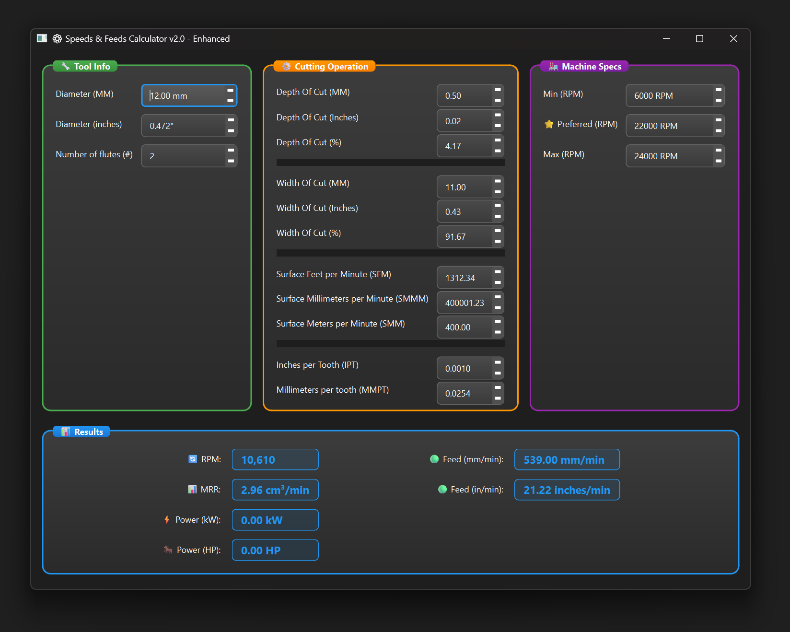

# CNC Speeds and Feeds Calculator

A desktop application for calculating optimal cutting parameters for CNC milling operations. Provides real-time calculation of spindle speeds (RPM), feed rates, and material removal rates based on tool geometry and cutting conditions.



## Features

- **Tool Parameter Input**: Tool diameter (metric/imperial) and flute count
- **Cutting Parameter Configuration**: Depth of cut, width of cut, surface speed, and feed per tooth
- **Machine Constraints**: Minimum and maximum spindle RPM limits
- **Real-time Calculations**: Automatic updates when parameters change
- **Unit Conversion**: Seamless switching between metric and imperial units
- **Material Database**: Built-in material properties for common workpiece materials

## Calculations

The application computes the following machining parameters:

- **Spindle Speed (RPM)**: `RPM = (Surface Speed × 1000) / (π × Tool Diameter)`
- **Feed Rate**: `Feed = RPM × Feed per Tooth × Number of Flutes`
- **Material Removal Rate (MRR)**: `MRR = Width of Cut × Depth of Cut × Feed Rate`

## Installation

### Pre-built Executable (Recommended)

Download the latest Windows executable from the [Releases](https://github.com/bhowiebkr/Speeds-And-Feeds/releases) page. No Python installation required.

### From Source

**Requirements:**
- Python 3.11
- PySide6

**Installation:**
```bash
git clone https://github.com/bhowiebkr/Speeds-And-Feeds.git
cd Speeds-And-Feeds
pip install -r requirements.txt
```

**Run:**
```bash
# Windows
run.bat

# Or directly with Python
python speeds_and_feeds.py
```

## Usage

1. **Tool Setup**: Enter tool diameter and number of flutes
2. **Cutting Parameters**: Set depth of cut, width of cut, and desired surface speed
3. **Feed Rate**: Specify feed per tooth based on material and tool manufacturer recommendations
4. **Machine Limits**: Configure spindle RPM constraints
5. **Results**: View calculated RPM, feed rate, and material removal rate

### Input Parameters

- **Tool Diameter**: Cutting tool diameter (mm or inches)
- **Flute Count**: Number of cutting edges on the tool
- **Depth of Cut (DOC)**: Axial cutting depth (mm or inches)
- **Width of Cut (WOC)**: Radial cutting width (mm or inches)
- **Surface Speed**: Cutting speed (SFM or m/min)
- **Feed per Tooth**: Chip load per cutting edge (inches or mm per tooth)

### Output Values

- **Spindle Speed**: Calculated RPM for the spindle
- **Feed Rate**: Table feed rate (IPM or mm/min)
- **Material Removal Rate**: Volume of material removed per unit time

## System Requirements

- Windows 10/11 (64-bit)
- 50 MB available disk space
- No additional software dependencies for pre-built executable

## Building from Source

For detailed build instructions including Nuitka compilation, see [BUILD.md](BUILD.md).

## Testing

Run the test suite to verify calculations:
```bash
# Windows
run_tests.bat

# Or directly with Python
python run_tests.py
```

## License

Open source project. See repository for license details.

## Formula References

Machining formulas based on industry standards referenced from [garrtool.com](https://www.garrtool.com/resources/machining-formulas/).